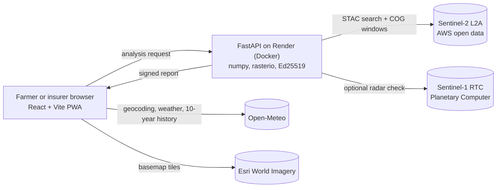

# FasalProof: prove your crop loss from space

**VORTEX 2K26 · Climate, Agriculture & Rural Innovation**

Free satellite and weather evidence for crop-insurance claims, for any farm on land worldwide.
A farmer describes what happened (in words or on a map); FasalProof compares Sentinel-2 satellite images from before and after the loss, checks the weather against that place's own history, applies the claim rules (India's PMFBY, or the farmer's own policy terms elsewhere), and produces a claim kit: letter, deadline reminders and a signed, tamper-evident report.

- Website: https://shahaadi2025-bit.github.io/fasalproof/
- API: https://fasalproof.onrender.com (`/docs` for the interactive reference)
- Source: https://github.com/shahaadi2025-bit/fasalproof

## Architecture


## What it does
| Area | Detail |
|---|---|
| Loss estimate | Cloud-masked (per pixel) NDVI before vs after; loss % with a 95% bootstrap interval |
| Counterfactual | Theil-Sen robust regression predicts the healthy curve; z-score and confidence the drop is not natural variation |
| Timing | Change-point detection compares the detected break date with the claimed date |
| Damage zones | 24x24 pixel change map clustered by k-means into severe / moderate / stable, drawn on the field |
| Weather | Rain around the loss date (or the 30 days before it, for drought) ranked against the same window in the previous 10 years |
| Crops | 20 crops with FAO-56 stage lengths and Kc; stage at loss, senescence guard, phenology consistency |
| Claims | India: PMFBY route (localised, area-yield, post-harvest, mid-season), 72-hour deadline, premium by class. Elsewhere: your own premium and notice period |
| Claim kit | Letter in six languages, calendar reminders (.ics), shareable link, CSV export, document checklist |
| Trust | Ed25519-signed report that anyone can verify; every result shows its uncertainty and scene count |
| Access | Assistant that fills the form from plain sentences (English, Hindi, Marathi, Spanish, French, Portuguese); installable, offline queue |
| Experimental (off by default) | Sentinel-1 radar flood check, on-device AI photo check, voice place search, Bayesian evidence fusion |

## Tech stack
Frontend: React 18, Vite, Leaflet, Recharts. Backend: Python 3.11, FastAPI, rasterio, numpy, pydantic, cryptography. Data: Sentinel-2 (ESA/Copernicus) via Earth Search, Open-Meteo, FAO-56, PMFBY guidelines. Ops: Docker, GitHub Pages, Render, GitHub Actions CI, pytest, Node tests.

## Run locally
```powershell
.\scripts\run.ps1            # backend on http://127.0.0.1:8000/docs
cd web; npm install; npm run dev
```

## Deploy and verify
```powershell
.\scripts\update-all.ps1     # push, redeploy, wait, verify
.\scripts\status.ps1         # plain-language DONE / TO DO list
.\scripts\verify-live.ps1    # full end-to-end test on the live system
```
Set `SIGNING_KEY` (base64 of 32 random bytes) in the host's environment so report signatures survive restarts.

## Tests
`pytest -q` (backend: statistics, signing, worldwide bounds, validation metrics) and `cd web && npm test` (frontend logic: analytics, claim rules, parser, climatology).

## Validation
**Not yet measured.** Fill `validation/events.csv` with documented damaged fields and no-event fields, run `.\scripts\validate.ps1`, and paste the table here. No accuracy figure is claimed until then. Spot checks on arbitrary no-event dates showed 14-19% apparent loss, so losses below roughly 25% should not be read as damage.

## Limitations
Supporting evidence, not an official assessment. NDVI cannot identify the crop. The plot is a square approximation. Stage lengths are FAO regional averages. Sum insured, notified crops and cut-off dates come from the user's policy. The claim engine encodes only India's PMFBY. Cloud cover can leave too few usable scenes.

## Data and licences
Sentinel-2: free and open (Copernicus). Open-Meteo: CC BY 4.0, free tier for non-commercial use. Esri World Imagery: check Esri's terms for your use. Code: MIT (see LICENSE). Originality and tooling notes: DISCLOSURE.md.

## Case study and evidence
`.\scripts\demo-case.ps1` runs a documented event (Ravi flood, Ajnala, 27 Aug 2025) end to end and writes a printable, signed evidence report with before/after satellite images, weather context, all candidate points, same-point controls from earlier years and limitations. `EVIDENCE.md` holds the sources, the field-selection rule, data limitations, false-positive observations and validation status. Backend v4.4 returns true-colour before/after chips; the app shows them as a slider and in the exported report.
